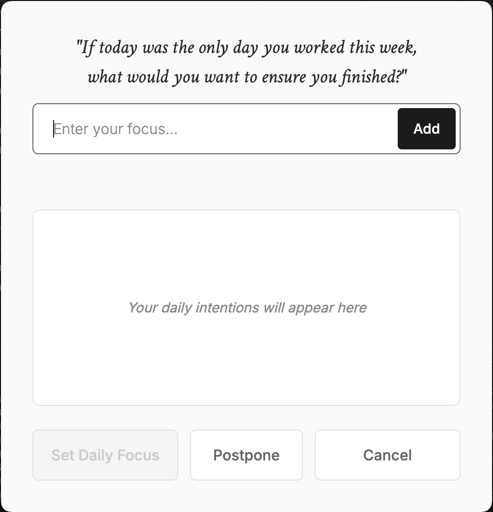

# Temporal Focus

[](https://opensource.org/licenses/MIT)
[](https://www.apple.com/macos/)
[](https://electronjs.org/)

A minimalist desktop application that prompts you with a daily focus question and sets your response as your desktop wallpaper.



## ✨ Features

- **Daily Prompt**: Asks you "If today was the only day you worked this week, what would you want to ensure you got done?"
- **Multiple Focus Items**: Add multiple tasks with drag-and-drop reordering
- **Wallpaper Generation**: Creates a minimalist black wallpaper with your focus items
- **Smart Scheduling**: 
  - Appears when you open your laptop each day
  - Resets at midnight
  - Backup prompt if missed
- **Snooze Options**: Postpone for 30m, 1h, 2h, or 6h
- **Menu Bar Integration**: Lives quietly in your menu bar
- **Auto-Launch**: Automatically starts when you log in

## 📥 Download

Download the latest version from the [GitHub Releases](../../releases/latest) page:

- **Intel Macs**: Download the `x64` version
- **Apple Silicon Macs (M1/M2/M3)**: Download the `arm64` version

## 🚀 Installation

1. Download the appropriate DMG file for your Mac
2. Double-click the DMG file to mount it
3. Drag "Temporal Focus" to your Applications folder
4. Launch the app from Applications

## 🔧 How It Works

### Daily Cycle
- **12:00 AM**: Daily state resets
- **Any time you open your laptop**: Shows prompt if not completed for the day
- **User Options**:
  - Complete focus → Set wallpaper, mark as done for day
  - Postpone → Hide for selected duration  
  - Cancel → Hide temporarily (will show again at backup time)

### Menu Bar
- Click the menu bar icon to manually open the focus prompt

## 🛡️ Privacy

- All data is stored locally on your machine
- No internet connection required
- No tracking or analytics
- Wallpapers are saved to `~/Library/Application Support/temporal-focus/wallpapers/`

## 📋 System Requirements

- macOS 10.14 or later
- Intel or Apple Silicon processor

## 🧠 Philosophy

Inspired by [temporal scarcity research](https://pubmed.ncbi.nlm.nih.gov/19121130/), this app encourages daily reflection on what truly matters. The minimalist design removes distractions, focusing your attention on intentional work.

*"If today was the only day you worked this week, what would you want to ensure you got done?"*

## 🏗️ Development

### Quick Start

```bash
# Install dependencies
npm install

# Start the app
npm start
```

That's it! The app will launch in development mode.

### Additional Scripts

```bash
# Run in development mode with auto-reload
npm run dev

# Build the application
npm run build

# Create a release build (outputs to release/ directory)
npm run dist
```

### Project Structure

```
├── src/
│   ├── main/          # Main electron process
│   ├── renderer/      # Renderer process (UI)
│   └── assets/        # Application assets
├── build/
│   └── icons/         # App icons
├── scripts/           # Build scripts
├── assets/            # DMG and build assets
├── docs/              # Documentation assets
└── release/           # Built releases
```

## 🤝 Contributing

Contributions are welcome! Please feel free to submit a Pull Request. For major changes, please open an issue first to discuss what you would like to change.

## 📄 License

This project is licensed under the MIT License - see the [LICENSE](LICENSE) file for details.

## 👨‍💻 Author

Created with ♥ by [Seva Mouler](mailto:seva@sevamouler.com)

- Website: [sevamouler.com](https://sevamouler.com)
- Email: [seva@sevamouler.com](mailto:seva@sevamouler.com)

---

*Built with Electron, TypeScript, and thoughtful design.* 